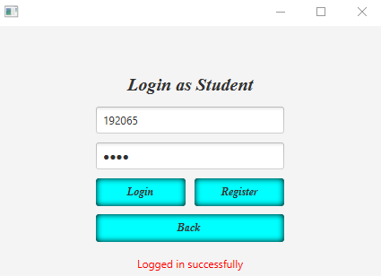

# Attendance-Management-System 📝

    

## <a name="system">What does it include?</a>

**Attendance Management System** is a software developed for keeping a tab of daily student attendance in schools, colleges and institutes. It is a system which keeps a record of lectures attended by students. Both teachers and students can use this system to view the attendance of a student who is already registered in the system. It also displays the percentage of overall attendance of a student which will help them to maintain the required percentage of attendance.

---

## <a name="system">Tech Stack Involved?</a>

**FRONTEND**
- Java
- FXML (javafx)

**BACKEND**
- JDBC
- MySQL

---

## <a name="system">Results?</a>

<table>
   <tr>
      <td></td>
      <td></td>
   </tr>
   <tr>
       <td>
<b>User Login</b>
</td>
      <td>
<b>Teacher Registration</b>
</td>
   </tr>
   <tr>
      <td></td>
      <td></td>
   </tr>
   <tr>
      <td>
<b>Student Registration</b>
</td>
      <td>
<b>Login Page</b>
</td>
   </tr>
   <tr>
      <td></td>
      <td></td>
   </tr>
    <tr>
      <td>
<b>Add Attendance</b>
</td>
      <td>
<b>View Attendance</b>
</td>
   </tr>
</table>

---
